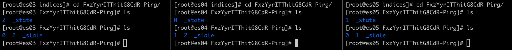
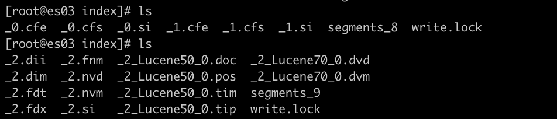

---

ES2
===

---

<br><br>

1.Elasticsearch Internal
------------------------

-	**refresh_interval** 설정은 얼마나 자주 Lucene flush가 발생하는지에 대해 정의한다. 말인즉, 얼마나 자주 각각의 샤드가 in-memory buffer로 부터 document를 제거하는지 그리고 그것들을 포함하는 segment를 만드는지를 의미한다. search의 관점에서, document가 index operation후에 검색이 불가능한 최대 시간을 의미한다.

###### 3 priamry shards, 0 replica shard, refresh interval 1 hour를 가지고 **my_refresh_test** index를 만들어 보자

<details><summary> 정답 </summary>

```shell
PUT my_refresh_test
{
  "settings": {
    "number_of_shards": 3,
    "number_of_replicas": 0,
    "refresh_interval": "1h"
  }
}
```

</details>

<br>

-	다음의 경로로 들어가보자

```shell
cd /var/lib/elasticsearch/nodes/0/indices
ls

# uuid로 나열된 index가 보인다.
```

<br>

###### kibana console에서 cat command를 사용해서 **my_refresh_test** index를 확인해보자

<details><summary> 정답 </summary>

```shell
GET _cat/indices/my_refresh_test?v

# output
health status index           uuid                   pri rep docs.count docs.deleted store.size pri.store.size
green  open   my_refresh_test FxzYyrITThitG8CdR-Pirg   3   0          0            0       783b           783b
```

</details>

<br><br>

-	첫번째 노드에서 uuid확인하여 **my_refresh_test** index의 경로로 들어가보자

```shell
# example
cd FxzYyrITThitG8CdR-Pirg/
ls

# output
2  _state
```

-	위의 output은 shard 2가 해당 노드에 위치해 있다는 것을 확인 할 수 있다.

-	kibana console에서 cat command를 사용해서 확인할 수 있다.

```shell
GET _cat/shards/my_refresh_test?v&s=node

# response
index           shard prirep state   docs store ip         node
my_refresh_test 2     p      STARTED    0  261b 10.142.0.4 itmare-hot01
my_refresh_test 0     p      STARTED    0  261b 10.142.0.5 itmare-hot02
my_refresh_test 1     p      STARTED    0  261b 10.142.0.6 itmare-hot03
```

<br>

###### **my_refresh_test** index의 replica 수를 1로 변경해보고, 첫노드의 shard folder에 있는 것들을 확인해보자.

<details><summary> 정답 </summary>

```shell
PUT my_refresh_test/_settings
{
    "number_of_replicas": 1
}
```

```shell
cd /var/lib/elasticsearch/nodes/0/indices
ls
```



-	각 노드별로 shard의 갯수가 늘어난 걸 확인 할 수 있다.

</details>

<br>

###### cat API를 통해 shard확인 해보자

<details><summary> 정답 </summary>

```shell
# node, shard 이름 순으로 정렬
GET _cat/shards/my_refresh_test?v&s=node,shard
```

</details>

<br>

###### 터미널에서 첫번쨰 노드의 shard 0d으로 들어가 보자

```shell
cd 0
ls
_state  index  translog
```

<br>

###### cd로 다시 index directory로 들어가보자

```shell
cd index
ls
segments_4  write.lock
```

-	해당 shard 경로에서 segment_x와 write.lock 파일을 볼 수 있다.

<br>

###### 데이터를 추가해보자

```
PUT my_refresh_test/_doc/_bulk
{ "index" : { "_id" : "1"}}
{ "level" : "test"}
{ "index" : { "_id" : "2"}}
{ "level" : "test"}
{ "index" : { "_id" : "8"}}
{ "level" : "test"}
```

<br>

###### search request를 실행했을때 몇개의 document가 리턴되고 왜 그럴까?

```shell
GET my_refresh_test/_search
```

<details><summary> 정답 </summary>

```shell
{
  "took" : 4,
  "timed_out" : false,
  "_shards" : {
    "total" : 3,
    "successful" : 3,
    "skipped" : 0,
    "failed" : 0
  },
  "hits" : {
    "total" : 0,
    "max_score" : null,
    "hits" : [ ]
  }
}
```

-	0개가 리턴된다. (hits.total => 0), 현재 refresh_interval이 1시간으로 설정되어 있다. 그래서 Lucene flush가 발생하고 document가 저장될 segment가 생성 될때까지 최대 1시간이 걸린다.

</details>

<br>

###### document 1을 호출하기 위해 GET request를 보내보자.

```shell
GET my_refresh_test/_doc/1
```

<details><summary> 정답 </summary> docuemnt 1은 리턴된다. 기본적으로 GET API는 실시간이다. index의 refresh rate에 영향을 받지 않는다.</details>

<br>

###### force refresh를 해보고, 다시 검색을 해보자 결과는? (hit의 갯수는?)

```shell
POST my_refresh_test/_refresh
```

<details><summary> 정답 </summary>

```shell
{
  "took" : 13,
  "timed_out" : false,
  "_shards" : {
    "total" : 3,
    "successful" : 3,
    "skipped" : 0,
    "failed" : 0
  },
  "hits" : {
    "total" : 3,
    "max_score" : 1.0,
    "hits" : [
      {
        "_index" : "my_refresh_test",
        "_type" : "_doc",
        "_id" : "2",
        "_score" : 1.0,
        "_source" : {
          "level" : "test"
        }
      },
      {
        "_index" : "my_refresh_test",
        "_type" : "_doc",
        "_id" : "8",
        "_score" : 1.0,
        "_source" : {
          "level" : "test"
        }
      },
      {
        "_index" : "my_refresh_test",
        "_type" : "_doc",
        "_id" : "1",
        "_score" : 1.0,
        "_source" : {
          "level" : "test"
        }
      }
    ]
  }
}
```

-	3개의 hit를 확인할 수 있다. `_refresh`는 in-memory buffer를 비우기 위해, 그리고 새로운 segment를 만들기 위한 lucene flush를 작동시킨다.

</details>

<br>

###### 다음과 같이 shard 경로안에 파일들이 생성된 것을 확인 할 수 있다.

[참고: Lucene Documentation](https://lucene.apache.org/core/2_9_4/fileformats.html#file-names)

<br>

###### 더 많은 데이터를 추가해보자

```
PUT my_refresh_test/_doc/_bulk
{ "index" : { "_id" : "3"}}
{ "level" : "test"}
{ "index" : { "_id" : "4"}}
{ "level" : "test"}
{ "index" : { "_id" : "14"}}
{ "level" : "test"}
```

-	shard 경로 확인 `_1.fdt`와 `_1.fdx`가 추가 되었다.


<br><br>

###### 다시 refresh하고 shard경로를 다시 확인해 보자

```shell
POST my_refresh_test/_refresh
```


<br><br>

###### 현재 2개의 segment를 가지고 있다. **my_refresh_test** index의 **_forcemerge** 를 실행해보고, shard 경로를 확인 해보자.

```shell
POST my_refresh_test/_forcemerge
```

-	아무런 옵션없는 forcemerge는 Lucene이 상황에 따라서 merge를 결정한다. 현재 2개의 아주 작은 segment를 가지고 있어서 Lucene은 merge하지 않기로 결정한 것으로 보인다.

<br>

###### **max_num_segments** parameter를 추가하여 다시한번 formerge 해보자.

```shell
POST my_refresh_test/_forcemerge?max_num_segments=1
```



-	`_0`과 `_1`로 시작하는 파일은 사라지고, `_2`로 시작하는 많은 파일들이 생긴다.

<br>

###### 현재 refresh_interval은 1시간으로 설정되어 있다. 때로는 즉각 refresh 필요한 문서가 있을지도 모른다. 이럴 경우, document를 추가할때 refresh option을 true로 설정하고 document를 추가해보자

```shell
PUT my_refresh_test/_doc/5?refresh=true
{
  "level":"test"
}

GET my_refresh_test/_search
```

-	refresh_interval이 1시간이지만 document가 바로 추가되는 것을 확인 할 수 있다.

<br>

###### 때로는 사용자가 response를 받고 싶을 수도 있다. refresh의 wait_for option을 사용해서, refresh_interval을 10초로 변경해보고, document를 추가해서 기다림을 확인해보자.

<details><summary> 정답 </summary>

```shell
PUT my_refresh_test/_settings
{
  "refresh_interval": "10s"
}

PUT my_refresh_test/_doc/6?refresh=wait_for
{
  "level":"waiting test"
}
```

</details>

<br>

###### **my_refresh_test** index를 삭제하자

```shell
DELETE my_refresh_test
```

<br><br><br><br><br>

2.Field Modeling
----------------

###### kibana console을 통해서 **blogs** index의 mapping을 확인해보고, 어떤 data type을 가지고 있는지 확인해보자

<details><summary> 정답 </summary> - data type이 `date`인 `publish_date` field를 제외하고 모든 field의 data type은 `text`이다.</details>

<br>

###### 다음의 질문은 어떤 과목에 대한 학생의 설문지이다. 그 아래 dataset은 설문에 대한 답변 중 하나이다.

-	"너의 직업은 무엇인가?"
-	1-10중에 training course rate은?
-	추가 커멘트는?
-	트레이닝을 참가하기 위해 얼마나 멀리서 왔는가?

```shell
{
  "job_title": "Elasticsearch Engineer",
  "course_rating": 9,
  "comments": "Great class. I want to get certified now!",
  "miles_travelled": "0-25"
}
```

###### `job_title` field에 대한 적절한 data type은 무엇인가?

<details><summary> 정답 </summary>

-	`text`, `keyword`: 유저가 원하는 아무것이나 넣을 수 있을 떄. (만약, UI에 고정된 숫자와 함께 drop-down 바가 있다면, `keyword`가 적절할 것이다.)

</details>

###### `comments` field에 대한 적절한 data type은 무엇인가?

<details><summary> 정답 </summary>

-	`text`: free-form text는 text

</details>

###### `miles_travelled` field에 대한 적절한 data type은 무엇인가?

<details><summary> 정답 </summary>

-	`integer_range`: 범위처럼 보이는 것은 range

</details>

<br>

###### **surveys** 이름으로 index를 다음의 조건에 맞게 생성해라.

-	1) mapping type은 "\_doc"
-	2) **job_title** field는 **text** 와 **keyword** 로 매핑해라.
-	3) **miles_travelled** field는 **integer_range** 로 매핑해라.
-	4) field name 끝에 **_rating** 으로 끝나는 field는 **integer** 로 **dynamic하게** 매핑해라.
-	5) 마지막으로, 아직 매핑되지 않은 string field들은 **dynamic하게** **keyword** 로 매핑해라. (the field is **not** indexed.)

<details><summary> 정답 </summary>

```shell
PUT surveys
{
  "mappings": {
    "_doc":{   # 1)
      "properties":{
        "job_title":{  # 2)
          "type":"text",
          "fields":{
            "keyword":{
              "type":"keyword"
            }
          }
        },
        "miles_travelled":{    # 3)
          "type":"integer_range"
        }
      },
      "dynamic_templates":[
        {
          "rating_fields":{   # 4)
            "match": "*_rating",
            "mapping":{
              "type":"integer"
            }
          }
        },
        {
          "undefined_string_fields":{   # 5)
            "match_mapping_type": "string",
            "mapping":{
              "type":"keyword",
              "index":false
            }
          }
        }
      ]
    }
  }
}
```

</details>

<br>

###### 다음을 **surveys** index에 추가하자. **miles_travelled** field를 적절한 포맷인 **integer_range** 로 변경해야 한다.

```shell
{
  "job_title": "Elasticsearch Engineer",
  "course_rating": 9,
  "comments": "Great class. I want to get certified now!",
  "miles_travelled": "0-25"
}
```

<details><summary> 정답 </summary>

```shell
PUT surveys/_doc/1
{
  "job_title": "Elasticsearch Engineer",
  "course_rating":9,
  "comments": "Great class. I want to get certified now!",
  "miles_travelled":{
    "gte":0,
    "lte": 25
  }
}
```

</details>

<br>

###### 다음 document를 **surveys** index에 추가하자.

```shell
PUT surveys/_doc/2
{
  "job_title": "Software Engineer",
  "labs_rating": 10,
  "city": "Berlin",
  "miles_travelled": {
    "gt": 50,
    "lte": 100
  }
}
```

<details><summary> 정답 </summary>

-	"labs_rating"은 integer로 매핑
-	"city"는 "index" set -> false와 함께 keyword로 매핑
-	"miles_travelled"는 integer_range로 매핑

```shell
GET surveys/_mapping
```

</details>

<br>

###### 30에서 60마일 사이를 여행한 학생의 모든 survey(document)를 찾는 쿼리를 작성해보자. (1 hit)

<details><summary> 정답 </summary>

```shell
GET surveys/_search
{
  "query":{
    "bool":{
      "filter": {
        "range": {
          "miles_travelled": {
            "gte": 30,
            "lte": 60
          }
        }
      }
    }
  }
}
```

</details>

<br>

###### **surveys2** 라는 이름으로 새로운 index를 만들어보자. **surveys2** index는 다음 4가지의 field만 mapping한다. (**copy_to** 와 default값을 null로 정의하는 것에 대한 리뷰)

-	1) field명이 "all_feedback", type이 "text"
-	2) field명이 "instructor_feedback", "all_feedback" field로 부터 copy된 "text" type
-	3) field명이 "labs_feedback", "all_feedback" field로 부터 copy된 "text" type
-	4) field명이 "course_rating", null값이 1이고 coercion이 disabled인 "integer" type
-	5) 추가적으로, mapping이 upexpected field로써 변하지 않고, unexpected field와 함께하는 document는 indexing이 실패할 것이다.

<details><summary> 정답 </summary>

```shell
PUT surveys2
{
  "mappings": {
    "_doc":{
      "dynamic": "strict",   # 5)
      "properties":{
        "all_feedback":{   # 1)
          "type": "text"
        },
        "instructor_feedback":{   # 2)
          "type": "text",
          "copy_to": "all_feedback"
        },
        "labs_feedback":{   # 3)
          "type": "text",
          "copy_to": "all_feedback"
        },
        "course_rating":{   # 4)
          "type": "integer",
          "null_value":1,
          "coerce": false
        }
      }  
    }
  }
}
```

-	corece: false 지정일 경우 숫자가 아니면 오류, true일 경우 문자열은 숫자로 변환, 정수필드에 실수가 들어오면 정수로 변환, [참고](https://www.elastic.co/guide/en/elasticsearch/reference/current/coerce.html)

</details>

<br>

###### **surveys2** index의 **all_feedback** field에 "great" term을 찾는 쿼리를 작성해보자. (1 hit)

<details><summary> 정답 </summary>

```shell
GET surveys2/_search
{
  "query":{
    "match":{
      "all_feedback": "great"
    }
  }
}
```

</details>

<br>

###### **course_rating** field에서 값이 1과 같거나 큰 document를 찾는 **range** query를 작성하자.

<details><summary> 정답 </summary>

```shell
GET surveys2/_search
{
  "query": {
    "bool": {
      "filter": {
        "range": {
          "course_rating": {
            "gte": 1
          }
        }
      }
    }
  }
}
```

</details>

<br>

###### 다음 3개의 **PUT** command를 실행해보고 각 결과를 예측해보자.

```shell
# 1.
PUT surveys2/_doc/2
{
  "course_rating": null
}

# 2.
PUT surveys2/_doc/3
{
  "course_rating": "8"
}

# 3.
PUT surveys2/_doc/4
{
  "food_rating": 10
}
```

<details><summary> 정답 </summary>

1.	**course_rating** field 값 **null** 과 함께 id가 2인 document가 추가된다.
2.	**course_rating** field 값 **"8"** 은 integer로 coerce될 수 없다. (coerce는 false로 설정되어 있다.)
3.	**surveys2** index의 "dynamic" setting은 "strict"으로 되어 있으므로, **food_rating** field는 추가 될 수 없다. [참고](https://www.elastic.co/guide/en/elasticsearch/reference/current/dynamic.html)

</details>

<br>

-	doc_values: Sorting, aggregations, and access to field values in scripts requires a different data access pattern.

###### 이름이 **test** 인 새로운 index를 만들기 위해 다음의 **PUT** command 실행하자. (type이 text인 **message** field와 type이 keyword이고 **doc_values** disable인 **level** field)

<details><summary> 정답 </summary>

```shell
GET test/_search
{
  "query": {
    "bool": {
      "filter": {
        "match": {
          "level": "INFO"
        }
      }
    }
  }
}
```

</details>

<br>

###### **level** field에서 top 5 값을 찾기위해, **term** aggregation을 실행해보자. 다음을 search했을때 어떤 결과가 나오나?

```shell
GET test/_search
{
  "size": 0,
  "aggs": {
    "top_levels": {
      "terms": {
        "field": "level",
        "size": 5
      }
    }
  }
}
```

<details><summary> 정답 </summary>

-	search 에러: **keyword** field는 **fielddata** 를 사용 할 수 없고, 대신 **doc_values** 를 사용해야 한다. **keyword** field에서 aggregation은 항상 **doc_values** 를 사용해야 하지만, 현재 **doc_values** 는 disable되어있다. 그래서 **level** field에서 aggregate할 수 없다. 만약 **doc_values** 를 enable하길 원한다면, 현재 data를 새로운 index로 reindex해야 한다.

</details>

<br>

###### **message** field에서 top 5 word를 찾기위해, **term** aggregation을 실행해보자. 다음을 search했을 때, 어떤 결과가 나오나?

```shell
GET test/_search
{
  "size": 0,
  "aggs": {
    "top_message_words": {
      "terms": {
          "field": "message",
          "size": 5
      }
    }
  }
}
```

<details><summary> 정답 </summary>

-	search 에러: **fielddata** 는 **text** field에서 disable되어 있다.

</details>

<br>

###### 때때로 data를 분석하거나, 디버깅 할때, analyzed field에서 aggregation을 실행이 이루어져야 한다. 하지만 **조심해야하는 이유가** 이것은 중요한 heap resource를 소비한다. **message** field를 위해 **fielddata** 를 enable하고, aggreation을 다시 사용해보자. 이번엔 **terms** aggregation이 성공할 것이다.

<details><summary> 정답 </summary>

```shell
PUT test/_mapping/_doc
{
  "properties":{
    "message":{
      "type": "text",
      "fielddata": true
    }
  }
}

GET test/_search
{
  "size": 0,
  "aggs": {
    "top_message_words": {
      "terms": {
        "field": "message",
        "size": 5
      }
    }
  }
}
```

</details>

<br>

##### test field를 삭제하자.

```shell
DELETE test
```

<br><br><br><br><br>

3.Fixing Data
-------------

###### **blogs** index 원본을 건드리지말고, 새로운 **blogs_fixed** index를 아래와 같이 mapping하고 reindex할 것이다.

```shell
PUT blogs_fixed
{
  "mappings": {
    "_doc": {
      "properties": {
        "author": {
          "type": "text",
          "fields": {
            "keyword": {
              "type": "keyword"
            }
          }
        },
        "category": {
          "type": "keyword"
        },
        "content": {
          "type": "text"
        },
        "locales": {
          "type": "keyword"
        },
        "publish_date": {
          "type": "date"
        },
        "seo_title": {
          "type": "text",
          "fields": {
            "keyword": {
              "type": "keyword"
            }
          }
        },
        "title": {
          "type": "text"
        },
        "url": {
          "type": "text",
          "fields": {
            "keyword": {
              "type": "keyword"
            }
          }
        },
        "number_of_views": {
          "type": "integer"
        },
        "reindexBatch": {
          "type": "byte"
        }
      }
    }
  }
}
```

###### **blogs_fixed** mapping은 **reindexBatch** 라는 integer field를 가지고 있다.

###### **blogs** index를 **blogs_fixed** index로 다음에 만족하도록 reindexing하자.

-	**"script"** 안에, 각 document에 **number_of_views** field를 추가하고 0으로 설정
-	**"script"** 안에, field name이 **reindexBatch** 인 index를 추가하고, 1로 설정

<details><summary> 정답 </summary>

```shell
POST _reindex
{
  "source": {
    "index": "blogs"
  },
  "dest":{
    "index": "blogs_fixed"
  },
  "script":{
    "source": """
ctx._source.number_of_views= 0;
ctx._source.reindexBatch = 1;
"""
  }
}

# 추가된 두개의 field값이 제대로 할당되었는지 확인
GET blogs_fixed/_search
```

</details>

<br>

###### blog가 web access logs를 기반으로 얻게되는 number of views를 업데이트하는 script를 작성해보자 (다음 조건에 만족하도록~)

-	script는 id **add_to_number_of_views** 와 함께 cluster state에 저장된다.
-	script는 **new_views** parameter에 있는 value를 **number_of_views** 에 추가 & 증가시킨다.

<details><summary> 정답 </summary>

```
POST _scripts/add_to_number_of_views
{
  "script":{
    "lang": "painless",
    "source":"""
ctx._source.number_of_views += params.new_views"
"""
  }
}
```

</details>

<br>

###### 다음 query를 실행해보자.

```shell
GET blogs_fixed/_search
{
  "query": {
    "bool": {
      "filter": {
        "match": {
          "url.keyword": "/blog/elasticsearch-storage-the-true-story"
        }
      }
    }
  }
}
```

-	1 hit: title이 "The true story behind Elasticsearch storage requirements"인 blog가 리턴된다.

<br>

###### 다음 query를 실행해보자.

```shell
GET logs_server*/_search
{
  "query": {
    "bool": {
      "filter": [
        {
          "range": {
            "@timestamp": {
              "gte": "2017-05-12",
              "lt": "2017-05-13"
            }
          }
        },
        {
          "match": {
            "originalUrl.keyword": "/blog/elasticsearch-storage-the-true-story"
          }
        }
      ]
    }
  }
}
```

-	상위 blog에 5월 12일의 모든 log entry가 hit된다. (41 hits)

<br>

###### **_update** 와 **add_to_number_of_views** script를 사용해서, 41을 blog의 **number_of_views** field에 더하자. blog의 **_id** 가 필요할 것이다.

<details><summary> 정답 </summary>

```shell
POST blogs_fixed/_doc/NXXVW2kBn3Lh_w-wuCGq/_update
{
  "script": {
    "id":"add_to_number_of_views",
    "params": {
      "new_views": 41
    }
  }
}
```

</details>

<br>

###### **number_of_views** field의 값이 제대로 들어갔는지 확인해보자.

<details><summary> 정답 </summary>

```shell
GET blogs_fixed/_doc/NXXVW2kBn3Lh_w-wuCGq
```

-	해당 blog의 **_id** 를 사용

</details>

<br>

###### 다음 query를 실행해보자. (같은 블로그에 5월 13일 결과는 11 hit)

```shell
GET logs_server*/_search
{
  "query": {
    "bool": {
      "filter": [
        {
          "range": {
            "@timestamp": {
              "gte": "2017-05-13",
              "lt": "2017-05-14"
            }
          }
        },
        {
          "match": {
            "originalUrl.keyword": "/blog/elasticsearch-storage-the-true-story"
          }
        }
      ]
    }
  }
}
```

<details><summary> 정답 </summary>

```shell
POST blogs_fixed/_doc/NXXVW2kBn3Lh_w-wuCGq/_update
{
  "script":{
    "id":"add_to_number_of_views",
    "params":{
      "new_views": 11
    }
  }
}

# 확인
GET blogs_fixed/_doc/NXXVW2kBn3Lh_w-wuCGq
```

</details>

<br>

###### 다음 query를 실행해서, **seo_title** field empty인 것을 찾아보자. 1,220개의 blog post의 **seo_title** field가 비워져 있을 것이다. (전체 blog의 75% 이상)

```shell
GET blogs_fixed/_search
{
  "query": {
    "bool": {
      "filter": {
        "match": {
          "seo_title.keyword": ""
        }
      }
    }
  }
}
```

###### 다음을 만족하는 ingest pipeline을 정의하자.

-	pipeline name은 **fix_seo_title**
-	**"script"** processor 추가, 만약 **seo_title** 이 emtpy string ""와 같으면, **seo_title** 을 **title** field의 값으로 설정

<details><summary> 정답 </summary>

```shell
PUT _ingest/pipeline/fix_seo_title
{
  "processors": [
    {
      "script":{
        "source": """
if ("".equals(ctx._source.seo_title))
{
  ctx.seo_title = ctx.title;
}
ctx.reindexBatch = 2;
"""
      }
    }
  ]
}
```

</details>

<br>

###### 생성한 pipeline은 전체 index에 적용하기 전에 샘플 document로 항상 테스트 해야한다. **fix_seo_title** pipeline을 다음 두개의 document를 가지고 테스트 해보자.

```shell
{
   "title": "Where in the World is Elastic? - Elastic{ON}Tour London & Paris",
   "seo_title": ""
}

{
   "title": "This week in Elasticsearch and Apache Lucene",
   "seo_title": "What's new in Elasticsearch and Apache Lucene"
}
```

<details><summary> 정답 </summary>

```shell
POST _ingest/pipeline/fix_seo_title/_simulate
{
  "docs": [
    {
      "_source":{
        "title": "Where in the World is Elastic? - Elastic{ON}Tour London & Paris",
        "seo_title": ""
      }
    },
    {
      "_source":{
        "title": "This week in Elasticsearch and Apache Lucene",
        "seo_title": "What's new in Elasticsearch and Apache Lucene"
      }
    }
  ]
}
```

</details>

<br>

###### 각각의 document를 **fix_seo_title** pipeline을 통해 보내기 위해, **blogs_fixed** index에서 **_update_by_query** 를 실행해 보자. Update by query는 **reindexBatch** value가 1인 document만 업데이트 해야 한다. (1594 document)

<details><summary> 정답 </summary>

```shell
POST blogs_fixed/_update_by_query?pipeline=fix_seo_title
{
  "query":{
    "match":{
      "reindexBatch": 1
    }
  }
}
```

-	첫 **_update_by_query** 는 시간이 조금 걸린다.

</details>

-	\_update_by_query API: source의 변경없이 index에 있는 모든 document의 업데이트를 수행한다. [Update By Query API](https://www.elastic.co/guide/en/elasticsearch/reference/current/docs-update-by-query.html)

<br>

###### 위의 update by query를 한번 더 실행해보자. 모든 document들은 첫 **_update_by_query** 에 의해 업데이트 되었기 때문에, 이번엔 아주 짧은 시간이 걸리고 0 document의 update를 볼 수 있다.

<br>

###### 다음 쿼리를 실행하고, 현재 **seo_title** field의 값이 empty인 것이 없음을 확인하자.

```shell
GET blogs_fixed/_search
{
  "query": {
    "bool": {
      "filter": {
        "match": {
          "seo_title.keyword": ""
        }
      }
    }
  }
}
```

<br>

###### **blogs_fixed** index의 **locales** field를 cleanup하자. 다음 term aggregation을 실행하고, 결과를 분석 하자.

```shell
GET blogs_fixed/_search
{
  "size": 0,
  "aggs": {
    "locale_terms": {
      "terms": {
        "field": "locales",
        "size": 10
      }
    }
  }
}
```

<br>

###### 총 1495 document의 **locales** field값이 비워져있는 것을 확인했다. 현재 locales field는 정리가 잘 안되어 있다. **locales** field를 다음 조건을 바탕으로 **pipeline** 을 만들어서 수정해보자.

-	pipeline의 이름은 **fix_locales** 로 정의
-	첫번째 processor는 **locales** field가 empty string임을 확인하는 **script** processor이다. 이런 경우에, **"en-en"** 값을 할당해라. empty가 아니라면 그냥 놔두자.
-	위에서 설정한 script processor는 모든 document의 **reindexBatch** 값을 3으로 설정 해야 한다.
-	두번째 processor는 separator로써 comma(,)를 사용하여 **locales** field값을 array로 나누는 **split** processor이다.

<details><summary> 정답 </summary>

```shell
PUT _ingest/pipeline/fix_locales
{
  "processors": [
    {
      "script": {
        "source": """
if("".equals(ctx.locales))
{
  ctx.locales = "en-en";
}
ctx.reindexBatch = 3;
"""
      }
    },
    {
      "split": {
        "field": "locales",
        "separator": ","
      }
    }
  ]
}
```

</details>

<br>

###### 다음 2 document를 가지고 **fix_locales** processor를 테스트 해보자.

```shell
{
  "locales": "de-de,fr-fr,ja-jp,ko-kr"
}

{
  "locales": ""
}
```

<details><summary> 정답 </summary>

```shell
POST _ingest/pipeline/fix_locales/_simulate
{
  "docs": [
    {
      "_source":{
        "locales": "de-de,fr-fr,ja-jp,ko-kr"
      }
    },
    {
      "_source":{
        "locales": ""
      }
    }
  ]
}

# result
{
  "docs" : [
    {
      "doc" : {
        "_index" : "_index",
        "_type" : "_type",
        "_id" : "_id",
        "_source" : {
          "locales" : [
            "de-de",
            "fr-fr",
            "ja-jp",
            "ko-kr"
          ],
          "reindexBatch" : 3
        },
        "_ingest" : {
          "timestamp" : "2019-04-03T07:21:43.162Z"
        }
      }
    },
    {
      "doc" : {
        "_index" : "_index",
        "_type" : "_type",
        "_id" : "_id",
        "_source" : {
          "locales" : [
            "en-en"
          ],
          "reindexBatch" : 3
        },
        "_ingest" : {
          "timestamp" : "2019-04-03T07:21:43.162Z"
        }
      }
    }
  ]
}
```

</details>

<br>

###### **_update_by_query** 를 사용해서, **blogs_fixed** index에 있는 **reindexBatch** field값이 2인 모든 document들을 업데이트 해보자.

<details><summary> 정답 </summary>

```shell
POST blogs_fixed/_update_by_query?pipeline=fix_locales
{
  "query":{
    "match":{
      "reindexBatch": 2
    }
  }
}
```

</details>

<br>

###### 다시 한번 **locales** field에서 **terms** aggregation을 실행해보고 분석해보자.

```shell
# query
GET blogs_fixed/_search
{
  "size": 0,
  "aggs": {
    "new_locales": {
      "terms": {
        "field": "locales",
        "size": 10
      }
    }
  }
}

# response
{
  "took" : 29,
  "timed_out" : false,
  "_shards" : {
    "total" : 5,
    "successful" : 5,
    "skipped" : 0,
    "failed" : 0
  },
  "hits" : {
    "total" : 1595,
    "max_score" : 0.0,
    "hits" : [ ]
  },
  "aggregations" : {
    "new_locales" : {
      "doc_count_error_upper_bound" : 0,
      "sum_other_doc_count" : 0,
      "buckets" : [
        {
          "key" : "en-en",
          "doc_count" : 1495
        },
        {
          "key" : "ja-jp",
          "doc_count" : 67
        },
        {
          "key" : "fr-fr",
          "doc_count" : 61
        },
        {
          "key" : "de-de",
          "doc_count" : 59
        },
        {
          "key" : "ko-kr",
          "doc_count" : 54
        },
        {
          "key" : "zh-chs",
          "doc_count" : 10
        }
      ]
    }
  }
}
```

<br>

###### 다음과 같이 **locales** field를 확인해보면, 값이 모두 array에 있는 것을 확인할 수 있다.

```shell
GET blogs_fixed/_search
{
  "size": 100,
  "_source": "locales"
}
```

<br><br><br><br><br>

4.Advanced Search & Aggregations
--------------------------------

###### **log_server*** document는 **runtime_ms** field를 가지고 있다. **script_fields** 를 사용해서, **runtime_ms** 의 값을 second로 리턴하는 query를 작성해보자.

<details><summary> 정답 </summary>

```shell
GET logs_server*/_search
{
  "script_fields": {
    "response_sec": {
      "script": {
        "lang": "painless",
        "source": """
doc['runtime_ms'].value /1000.0
"""
      }
    }
  }
}
```

</details>

<br>

###### 다음을 만족하는 query를 작성해 보자.

-	1) **script_fields** 를 사용해서, **geoip.city_name** 값과 **geoip.region_name** 값이 comma(,)로 분리된 single field를 리턴
-	2) **geoip.city_name** field와 **geoip.region_name** field 둘다 존재하고, null값이 아닌 document를 리턴
-	3) 각 hit의 모든 **_source** 를 리턴

<details><summary> 정답 </summary>

```shell
GET logs_server*/_search
{
  "_source": [],  ### 3)
  "script_fields": {   ### 1)
    "city_region": {
      "script": {
        "lang": "painless",
        "source": """
doc['geoip.city_name.keyword'].value + "," + doc['geoip.region_name.keyword'].value
"""
      }
    }
  },
  "query":{   ### 2)
    "bool": {
      "filter": [
        {
          "exists":{
            "field": "geoip.city_name"
          }
        },
        {
          "exists":{
            "field": "geoip.region_name"
          }
        }
      ]
    }
  }
}
```

</details>

<br>

###### 다음 query를

```shell
GET logs_server*/_search
{
  "query": {
    "bool": {
      "filter": [
        {
          "range": {
            "@timestamp": {
              "gte": "2017-05-12",
              "lt": "2017-05-13"
            }
          }
        },
        {
          "match": {
            "originalUrl.keyword": "/blog/elasticsearch-storage-the-true-story"
          }
        }
      ]
    }
  }
}
```

<details><summary> 정답 </summary>

```shell
POST _scripts/daily_hits
{
  "script":{
    "lang": "mustache",
    "source": {
      "query":{
        "bool":{
          "must":{
            "match":{
              "originalUrl.keyword": "{{url}}"
            }
          },
          "filter":{
            "range": {
              "@timestamp": {
                "gte": "{{start_date}}",
                "lt": "{{end_date}}"
              }
            }
          }
        }
      }
    }
  }
}
```

</details>

<br>

###### **daily_hits** search template을 다음 value를 가지고 테스트해보자.

-	url: "/blog/brewing-in-beats-postgresql-module-in-filebeat"
-	start_date: "2017-08-11"
-	end_date: "2017-08-12"

<details><summary> 정답 </summary>

```shell
GET logs_server*/_search/template
{
  "id": "daily_hits",
  "params": {
    "url": "/blog/brewing-in-beats-postgresql-module-in-filebeat",
    "start_date": "2017-08-11",
    "end_date": "2017-08-12"
  }
}
```

</details>

<br>

###### **daily_hits** search template에서 **end_date** parameter를 제거해보자.

<details><summary> 정답 </summary>

```shell
POST _scripts/daily_hits
{
  "script": {
    "lang": "mustache",
    "source": """
    {
      "query": {
        "bool": {
          "must": {
            "match": {
              "originalUrl.keyword": "{{url}}"
            }
          },
          "filter": {
            "range": {
              "@timestamp": {
                "gte": "{{start_date}}"
                {{#end_date}}
                ,

                "lt": "{{end_date}}"
                {{/end_date}}
              }
            }
          }
        }
      }
    }
"""
  }
}
```

</details>

<br>

###### **date_historgram** aggregation을 사용해서 월별 visitor의 수를 분석해보자. aggregation 이름은 **number_of_visitors_by_month"** 로 정하고, 월별 웹사이트의 visitor수를 계산하자.

<details><summary> 정답 </summary>

```shell
GET logs_server*/_search
{
  "size": 0,
  "aggs": {
    "number_of_visitors_by_month": {
      "date_histogram": {
        "field": "@timestamp",
        "interval": "month"
      }
    }
  }
}
```

</details>

<br>

###### **max_monthly_visitors** 라는 이름으로, 가장 많이 방문한 달을 계산하는 pipeline aggregation을 추가하자.

<details><summary> 정답 </summary>

```shell
GET logs_server*/_search
{
  "size": 0,
  "aggs": {
    "number_of_visitors_by_month": {
      "date_histogram": {
        "field": "@timestamp",
        "interval": "month"
      }
    },
    "max_monthly_visitors":{
      "max_bucket": {
        "buckets_path": "number_of_visitors_by_month._count"
      }
    }
  }
}
```

</details>

<br>

###### 각 월마다 top 5 visited URL을 찾는 **top_visited_urls** nested aggregation을 **number_of_visitors_by_month** 에 추가하자. (**originalUrl.keyword** field를 사용)

<details><summary> 정답 </summary>

```shell
GET logs_server*/_search
{
  "size": 0,
  "aggs": {
    "number_of_visitors_by_month": {
      "date_histogram": {
        "field": "@timestamp",
        "interval": "month"
      },
      "aggs": {
        "top_visited_urls": {
          "terms": {
            "field": "originalUrl.keyword",
            "size": 5
          }
        }
      }

    },
    "max_monthly_visitors":{
      "max_bucket": {
        "buckets_path": "number_of_visitors_by_month._count"
      }
    }
  }
}
```

</details>

<br>

###### **number_of_visitors_by_month** 에 **most_visited_url_of_month** pipeline aggregation을 추가하자. **most_visited_urL_month** pipeline aggregation은 달마다 가장 많은 방문객 수를 계산한다. 위에 **term** agg에서 이미 해당 값을 return 했지만, pipeline agg에서 max value만을 찾아보자.

<details><summary> 정답 </summary>

```shell
GET logs_server*/_search
{
  "size": 0,
  "aggs": {
    "number_of_visitors_by_month": {
      "date_histogram": {
        "field": "@timestamp",
        "interval": "month"
      },
      "aggs": {
        "top_visited_urls": {
          "terms": {
            "field": "originalUrl.keyword",
            "size": 5
          }
        },
        "most_visited_url_of_month": {
          "max_bucket": {
            "buckets_path": "top_visited_urls._count"
          }
        }
      }
    },
    "max_monthly_visitors": {
      "max_bucket": {
        "buckets_path": "number_of_visitors_by_month._count"
      }
    }
  }
}
```

</details>

<br>

###### **most_visited_url_of_month** **most_visited_url_of_month** 의 가장 큰 값을 찾는 **month_with_most_visited_url_by_month** pipe aggregation을 추가해 보자.

<details><summary> 정답 </summary>

```shell
GET logs_server*/_search
{
  "size": 0,
  "aggs": {
    "number_of_visitors_by_month": {
      "date_histogram": {
        "field": "@timestamp",
        "interval": "month"
      },
      "aggs": {
        "top_visited_urls": {
          "terms": {
            "field": "originalUrl.keyword",
            "size": 5
          }
        },
        "most_visited_url_of_month": {
          "max_bucket": {
            "buckets_path": "top_visited_urls._count"
          }
        }
      }
    },
    "max_monthly_visitors": {
      "max_bucket": {
        "buckets_path": "number_of_visitors_by_month._count"
      }
    },
    "month_with_most_visited_url_by_month": {
      "max_bucket": {
        "buckets_path": "number_of_visitors_by_month>most_visited_url_of_month"
      }
    }
  }
}
```

</details>

<br>

###### **originalUrl.keyword** field를 missing한 log event의 수를 리턴하는 aggregation을 작성해 보자.

<details><summary> 정답 </summary>

```shell
GET logs_server*/_search
{
  "size": 0,
  "aggs": {
    "missing_log_events": {
      "missing": {
        "field": "originalUrl.keyword"
      }
    }
  }
}
```

</details>

<br>

###### top 20 도시 각각에서 top 3 URL은 무엇인지 확인해보자. 두개의 각기 다른 query의 결과값을 비교 분석해보자.

<details><summary> 정답 </summary>

```shell
GET logs_server*/_search
{
  "size": 0,
  "aggs": {
    "top_20_cities": {
      "terms": {
        "field": "geoip.city_name.keyword",
        "size": 20
      },
      "aggs":{
        "top_urls": {
          "terms":{
            "field": "originalUrl.keyword",
            "size": 3
          }
        }
      }
    }
  }
}
```

</details>

<br>

###### top 3 URL의 **terms** aggregation을 **significant_terms** aggregation으로 바꾸고, 두개의 query를 비교해 보. (Notice how the URLs have changed to be less generic and more specific topics.)

<details><summary> 정답 </summary>

```shell

GET logs_server*/_search
{
  "size": 0,
  "aggs": {
    "top_cities": {
      "terms": {
        "field": "geoip.city_name.keyword",
        "size": 20
      },
      "aggs": {
        "top_urls": {
          "significant_terms": {
            "field": "originalUrl.keyword",
            "size": 3
          }
        }
      }
    }
  }
}
```

</details>

<br>

###### 다음 query는 2017년 8월 첫주의 모든 log를 리턴한다. 다음을 만족하는 **status_plus_url_terms** 라는 이름의 **terms** aggregation을 추가하자.

-	term으로써, **geoip.region_name** 과 **originalUrl** 의 combination을 사용해라. script에서 두개의 field는 semi-colon(:)으로 구분된다.
-	100의 term을 리턴해라.

```shell
GET logs_server*/_search
{
  "size": 0,
  "query": {
    "bool": {
      "filter": {
        "range": {
          "@timestamp": {
            "gte": "2017-08-01",
            "lte": "2017-08-07"
          }
        }
      }
    }
  }
}
```

<details><summary> 정답 </summary>

```shell
GET logs_server*/_search
{
  "size": 0,
  "query": {
    "bool": {
      "filter": {
        "range": {
          "@timestamp": {
            "gte": "2017-08-01",
            "lte": "2017-08-07"
          }
        }
      }
    }
  },
  "aggs": {
    "status_plus_url_terms": {
      "terms": {
        "script": {
          "source": """
doc['geoip.region_name.keyword'].value + ':' + doc['originalUrl.keyword'].value
"""
        },
        "size": 100
      }
    }
  }
}
```

</details>

<br>

###### 위의 결과에 **region_name** 이 **null** 값인 log event가 많다. 우의 query를 변경해서 **region_name** 이 null이 아닌 document의 **terms** agg만을 결과값으로 리턴하도록 수정해보자.

<details><summary> 정답 </summary>

```shell
GET logs_server*/_search
{
  "size": 0,
  "query": {
    "bool": {
      "filter": [
        {
          "range": {
            "@timestamp": {
              "gte": "2017-08-01",
              "lte": "2017-08-07"
            }
          }
        },
        {
          "exists":{
            "field": "geoip.region_name"
          }
        }
      ]
    }
  },
  "aggs": {
    "status_plus_url_terms": {
      "terms": {
        "script": {
          "source": """
doc['geoip.region_name.keyword'].value + ':' + doc['originalUrl.keyword'].value
"""
        },
        "size": 100
      }
    }
  }
}
```

</details>

<br>

###### 각각의 term에서 top3 log event를 리턴하는 **top_hits** aggregation을 **status_plus_url_terms** 에 추가시켜보자.

<details><summary> 정답 </summary>

```shell
GET logs_server*/_search
{
  "size": 0,
  "query": {
    "bool": {
      "filter": [
        {
          "range": {
            "@timestamp": {
              "gte": "2017-08-01",
              "lte": "2017-08-07"
            }
          }
        },
        {
          "exists":{
            "field": "geoip.region_name"
          }
        }
      ]
    }
  },
  "aggs": {
    "status_plus_url_terms": {
      "terms": {
        "script": {
          "source": "doc['geoip.region_name.keyword'].value + ':' + doc['originalUrl.keyword'].value"
        },
        "size": 100,
        "order": {
          "_key": "asc"
        }
      },
      "aggs": {
        "top_hits_of_status_plus_url_terms": {
          "top_hits": {
            "size": 3
          }
        }
      }
    }
  }
}
```

</details>

<br>

<br><br><br><br><br>

5.Cluster Management
--------------------

###### 5대의 서버에 다음과 같이 설정해 보자.

-	**"my_temp"**, **"my_rack"** tag names 설정
-	**"my_cluster"** cluster name으로 설정
-	**minimum_master_nodes** 값을 1로 설정
-	각 노드의 **network.host** 값을 **"\_site\_"** 로 설정

| Node  | Server  | Type                      | box_type | rack_type |
|:-----:|:-------:|:-------------------------:|:--------:|:---------:|
| node1 | server1 | dedicated master-eligible |   none   |   none    |
| node2 | server2 |      data and ingest      |   hot    |   rack1   |
| node3 | server3 |      dedicated data       |   warm   |   rack1   |
| node4 | server4 |      data and ingest      |   hot    |   rack2   |
| node5 | server5 |      dedicated data       |   warm   |   rack2   |

<details><summary> 정답 </summary>

```shell
#node1 config
cluster.name: my_cluster
node.name: ${NODENAME}
network.host: _site_
discovery.zen.minimum_master_nodes: 1
discovery.zen.ping.unicast.hosts: ["server1","server2","server3"]
xpack.security.enabled: true
node.master: true
node.data: false
node.ingest: false

#node2 config
cluster.name: my_cluster
node.name: ${NODENAME}
network.host: _site_
discovery.zen.ping.unicast.hosts: ["server1","server2","server3"]
xpack.security.enabled: true
node.master: false
node.data: true
node.ingest: true
node.attr.my_temp: hot
node.attr.my_rack: rack1

#node3 config
cluster.name: my_cluster
node.name: ${NODENAME}
network.host: _site_
discovery.zen.ping.unicast.hosts: ["server1","server2","server3"]
xpack.security.enabled: true
node.master: false
node.data: true
node.ingest: false
node.attr.my_temp: warm
node.attr.my_rack: rack1

#node4 config
cluster.name: my_cluster
node.name: ${NODENAME}
network.host: _site_
discovery.zen.ping.unicast.hosts: ["server1","server2","server3"]
xpack.security.enabled: true
node.master: false
node.data: true
node.ingest: true
node.attr.my_temp: hot
node.attr.my_rack: rack2

#node5 config
cluster.name: my_cluster
node.name: ${NODENAME}
network.host: _site_
discovery.zen.ping.unicast.hosts: ["server1","server2","server3"]
xpack.security.enabled: true
node.master: false
node.data: true
node.ingest: false
node.attr.my_temp: warm
node.attr.my_rack: rack2
```

</details>

<br>

<details><summary> my config settings </summary>

```shell
# node1
path.data: /var/lib/elasticsearch
path.logs: /var/log/elasticsearch
path.repo: /shared_folder/my_repo

network.host: _site_
http.cors.enabled: true
http.cors.allow-origin: "*"
discovery.zen.ping.unicast.hosts: ["es01:9300", "es02:9300", "es03:9300"]
discovery.zen.minimum_master_nodes: 1
network.bind_host: 0.0.0.0
network.publish_host: es01
http.port: 9200
transport.tcp.port: 9300

cluster.name: my_cluster
node.name: node1
node.master: true
node.data: false
node.ingest: false

xpack.security.enabled: false

# node2
path.data: /var/lib/elasticsearch
path.logs: /var/log/elasticsearch
path.repo: /shared_folder/my_repo

network.host: _site_
http.cors.enabled: true
http.cors.allow-origin: "*"
discovery.zen.ping.unicast.hosts: ["es01:9300", "es02:9300", "es03:9300"]
discovery.zen.minimum_master_nodes: 1
network.bind_host: 0.0.0.0
network.publish_host: es02
http.port: 9200
transport.tcp.port: 9300

cluster.name: my_cluster
node.name: node2
node.master: false
node.data: true
node.ingest: true

node.attr.box_type: hot
node.attr.rack_type: rack1

xpack.security.enabled: false

# node3
path.data: /var/lib/elasticsearch
path.logs: /var/log/elasticsearch
path.repo: /shared_folder/my_repo

network.host: _site_
http.cors.enabled: true
http.cors.allow-origin: "*"
discovery.zen.ping.unicast.hosts: ["es01:9300", "es02:9300", "es03:9300"]
discovery.zen.minimum_master_nodes: 1
network.bind_host: 0.0.0.0
network.publish_host: es03
http.port: 9200
transport.tcp.port: 9300

cluster.name: my_cluster
node.name: node3
node.master: false
node.data: true
node.ingest: false

node.attr.box_type: warm
node.attr.rack_type: rack1

xpack.security.enabled: false

# node4
path.data: /var/lib/elasticsearch
path.logs: /var/log/elasticsearch
path.repo: /shared_folder/my_repo

network.host: _site_
http.cors.enabled: true
http.cors.allow-origin: "*"
discovery.zen.ping.unicast.hosts: ["es01:9300", "es02:9300", "es03:9300"]
discovery.zen.minimum_master_nodes: 1
network.bind_host: 0.0.0.0
network.publish_host: es04
http.port: 9200
transport.tcp.port: 9300


cluster.name: my_cluster
node.name: node4
node.master: false
node.data: true
node.ingest: true

node.attr.box_type: hot
node.attr.rack_type: rack2

xpack.security.enabled: false

# node5
path.data: /var/lib/elasticsearch
path.logs: /var/log/elasticsearch
path.repo: /shared_folder/my_repo

network.host: _site_
http.cors.enabled: true
http.cors.allow-origin: "*"
discovery.zen.ping.unicast.hosts: ["es01:9300", "es02:9300", "es03:9300"]
discovery.zen.minimum_master_nodes: 1
network.bind_host: 0.0.0.0
network.publish_host: es05
http.port: 9200
transport.tcp.port: 9300


cluster.name: my_cluster
node.name: node5
node.master: false
node.data: true
node.ingest: false

node.attr.box_type: warm
node.attr.rack_type: rack2

xpack.security.enabled: false
```

</details>

###### **cat** api를 사용해서 node와 attr설정을 확인해보자.

<details><summary> 정답 </summary>

```shell
GET _cat/nodes?v
GET _cat/nodeattrs?v
```

</details>

<br>

###### **logs_server1** 과 **logs_server2** index를 warm node로만 할당하고, **logs_server3** index는 hot node로만 할당하도록 설정해보자.

<details><summary> 정답 </summary>

```shell
PUT logs_server1/_settings
{
  "index.routing.allocation.require.box_type": "warm"
}

PUT logs_server2/_settings
{
  "index.routing.allocation.require.box_type": "warm"
}

PUT logs_server3/_settings
{
  "index.routing.allocation.require.box_type": "hot"
}
```

</details>

<br>

###### **cat** command를 통해, shard filtering이 제대로 작동 했는데 확인해보자.

<details><summary> 정답 </summary>

```shell
GET _cat/shards/logs_server*?v&h=index,shard,node&s=index,shard,node
```

</details>

<br>

###### 강제로 shard allocation awareness를 실행하기 위한 **rack_type** attribute를 사용하는 cluster를 **transient** setting을 사용하여 설정해보자.

<details><summary> 정답 </summary>

```shell
PUT _cluster/settings
{
  "transient": {
    "cluster":{
      "routing":{
        "allocation.awareness.attributes": "rack_type",
        "allocation.awareness.force.rack_type.values": "rack1,rack2"
      }
    }
  }
}
```

</details>

<br>

###### 다음과 같이 \_cat API를 실행해보고, 결과를 확인해 보자.

```shell
GET _cat/shards/logs_server*?v&h=index,shard,prirep,state,node&s=index,shard
```

-	각각의 primary와 replica shard는 다른 rack에 위치하게 된다. 다음과 비슷한 결과 확인 가능

```shell
index        shard prirep state   node
logs_server1 0     r      STARTED node5
logs_server1 0     p      STARTED node3
logs_server1 1     p      STARTED node5
logs_server1 1     r      STARTED node3
logs_server1 2     r      STARTED node5
logs_server1 2     p      STARTED node3
logs_server1 3     r      STARTED node5
logs_server1 3     p      STARTED node3
logs_server1 4     r      STARTED node5
logs_server1 4     p      STARTED node3
logs_server2 0     p      STARTED node5
logs_server2 0     r      STARTED node3
logs_server2 1     p      STARTED node5
logs_server2 1     r      STARTED node3
logs_server2 2     r      STARTED node5
logs_server2 2     p      STARTED node3
logs_server2 3     r      STARTED node5
logs_server2 3     p      STARTED node3
logs_server2 4     r      STARTED node5
logs_server2 4     p      STARTED node3
logs_server3 0     p      STARTED node2
logs_server3 0     r      STARTED node4
logs_server3 1     p      STARTED node2
logs_server3 1     r      STARTED node4
logs_server3 2     r      STARTED node2
logs_server3 2     p      STARTED node4
logs_server3 3     p      STARTED node2
logs_server3 3     r      STARTED node4
logs_server3 4     r      STARTED node2
logs_server3 4     p      STARTED node4
```

<br><br><br><br><br>

6.Capacity Planning
-------------------

###### 1 primary와 1 replica shard를 포함하는 **logs-2018-07-04** index를 생성하자.

<details><summary> 정답 </summary>

```shell
PUT logs-2018-07-04
{
  "settings": {
    "number_of_shards": 1,
    "number_of_replicas": 1
  }
}
```

</details>

<br>

###### **logs-2018-07-04** index를 **logs-write** alias로 정의하자.

<details><summary> 정답 </summary>

```shell
POST _aliases
{
  "actions": [
    {
      "add": {
        "index": "logs-2018-07-04",
        "alias": "logs-write"
      }
    }
  ]
}
```

</details>

<br>

###### **logs-2018-07-04** index를 **logs-read** 이름으로 alias를 정의해 보자.

<details><summary> 정답 </summary>

```shell
POST _aliases
{
  "actions": [
    {
      "add": {
        "index": "logs-2018-07-04",
        "alias": "logs-read"
      }
    }
  ]
}
```

</details>

<br>

###### **bulk** command를 사용해서, 다음 log document를 **log-write** index에 indexing해 보자.

```
PUT logs-write/_doc/_bulk
{ "index" : { "_id" : "1"}}
{ "level" : "INFO", "message" : "recovered [20] indices into cluster_state", "date" : "2018-07-04"}
{ "index" : { "_id" : "2"}}
{ "level" : "WARN", "message" : "received shard failed for shard id 0", "date" : "2018-07-04"}
{ "index" : { "_id" : "3"}}
{ "level" : "INFO", "message" : "Cluster health status changed from [YELLOW] to [GREEN]", "date" : "2018-07-04"}
```

<br>

###### 다음 query를 실행해서 추가한 3개의 document를 확인해보자.

```shell
GET logs-read/_search
```

<br>

###### 날짜가 7월4일에서 7월5일로 변경되었다고 가정하고, primary shard가 1, replica shard가 1인 새로운 **logs-2018-07-05** index를 생성 해보자.

<details><summary> 정답 </summary>

```shell
PUT logs-2018-07-05
{
  "settings": {
    "number_of_shards": 1,
    "number_of_replicas": 1
  }
}
```

</details>

<br>

###### **logs-write** alias를 **logs-2018-07-04** index에서 제거하고, **logs-2018-07-04** index에 할당해 보자.

<details><summary> 정답 </summary>

```shell
POST _aliases
{
  "actions": [
    {
      "add": {
        "index": "logs-2018-07-05",
        "alias": "logs-write"
      }
    },
    {
      "remove": {
        "index": "logs-2018-07-04",
        "alias": "logs-write"
      }
    }
  ]
}
```

</details>

<br>

###### 다음의 log event document를 **log-write** alias를 통해 indexing해보자.

```
PUT logs-write/_doc/_bulk
{ "index" : { "_id" : "4"}}
{ "level" : "INFO", "message" : "[node2] started", "date" : "2018-07-05"}
{ "index" : { "_id" : "5"}}
{ "level" : "WARN", "message" : "not enough master nodes discovered during pinging", "date" : "2018-07-05"}
```

###### 다음 query를 실행해서 위 2개의 document가 제대로 indexing 되었는지 확인해보자. (2 hits)

```shell
GET logs-2018-07-05/_search
```

<br>

###### **logs-2018-07-05** index를 **logs-read** alias에 추가하자.

<details><summary> 정답 </summary>

```shell
POST _aliases
{
  "actions": [
    {
      "add": {
        "index": "logs-2018-07-05",
        "alias": "logs-read"
      }
    }
  ]
}
```

</details>

<br>

###### 다음 query를 실행 해보고, 결과를 분석해보자. (5 hits)

```shell
GET logs-read/_search
```

<br>

###### 다음 query를 실행 했을때, 어떤 상황이 벌어질까?

```shell
DELETE logs-read
```

<details><summary> 정답 </summary> - 에러 발생, alias를 삭제할 수 없다. 6.0이하 버전에서는 alias에 해당하는 모든 index를 삭제 했지만, index삭제를 위해선 정확한 index 명을 입력해야한다. 위의 command는 잘못된 command이다.</details>

<br><br><br><br><br>

7.Document Modeling
-------------------

######

<details><summary> 정답 </summary>

</details>

<br>

<br><br><br><br><br>

8.Monitoring and Alerting
-------------------------

<br><br><br><br><br>

9.From Dev to Production
------------------------

.

.

.

.

.

.

.

.

.

.

.

.

.

.

.

.

.

.

---

Exam Objectives
---------------

<br><br>

To be fully prepared for the Elastic Certified Engineer exam, candidates should be able to complete all of the following exam objectives with only the assistance of the [Elastic documentation](https://www.elastic.co/guide/index.html):

<br>

#### Installation and Configuration

-	Deploy and start an Elasticsearch cluster that satisfies a given set of requirements
-	Configure the nodes of a cluster to satisfy a given set of requirements
-	Secure a cluster using Elasticsearch Security ([doc](https://www.elastic.co/guide/en/elasticsearch/plugins/current/security.html)\)
-	Define role-based access control using Elasticsearch Security ([doc](https://www.elastic.co/guide/en/kibana/current/development-security-rbac.html)\)

#### Indexing Data

-	Define an index that satisfies a given set of requirements

-	Perform index, create, read, update, and delete operations on the documents of an index

-	Define and use index aliases

-	Define and use an index template for a given pattern that satisfies a given set of requirements

-	Define and use a dynamic template that satisfies a given set of requirements

-	Use the Reindex API and Update By Query API to reindex and/or update documents

-	Define and use an ingest pipeline that satisfies a given set of requirements, including the use of Painless to modify documents

#### Queries

-	Write and execute a search query for terms and/or phrases in one or more fields of an index

-	Write and execute a search query that is a Boolean combination of multiple queries and filters

-	Highlight the search terms in the response of a query

-	Sort the results of a query by a given set of requirements

-	Implement pagination of the results of a search query

-	Use the scroll API to retrieve large numbers of results

-	Apply fuzzy matching to a query

-	Define and use a search template

-	Write and execute a query that searches across multiple clusters

#### Aggregations

-	Write and execute metric and bucket aggregations

-	Write and execute aggregations that contain sub-aggregations

-	Write and execute pipeline aggregations

#### Mappings and Text Analysis

-	Define a mapping that satisfies a given set of requirements

-	Define and use a custom analyzer that satisfies a given set of requirements

-	Define and use multi-fields with different data types and/or analyzers

-	Configure an index so that it properly maintains the relationships of nested arrays of objects

-	Configure an index that implements a parent/child relationship

#### Cluster Administration

-	Allocate the shards of an index to specific nodes based on a given set of requirements

-	Configure shard allocation awareness and forced awareness for an index

-	Diagnose shard issues and repair a cluster’s health

-	Backup and restore a cluster and/or specific indices

-	Configure a cluster for use with a hot/warm architecture

-	Configure a cluster for cross cluster search
